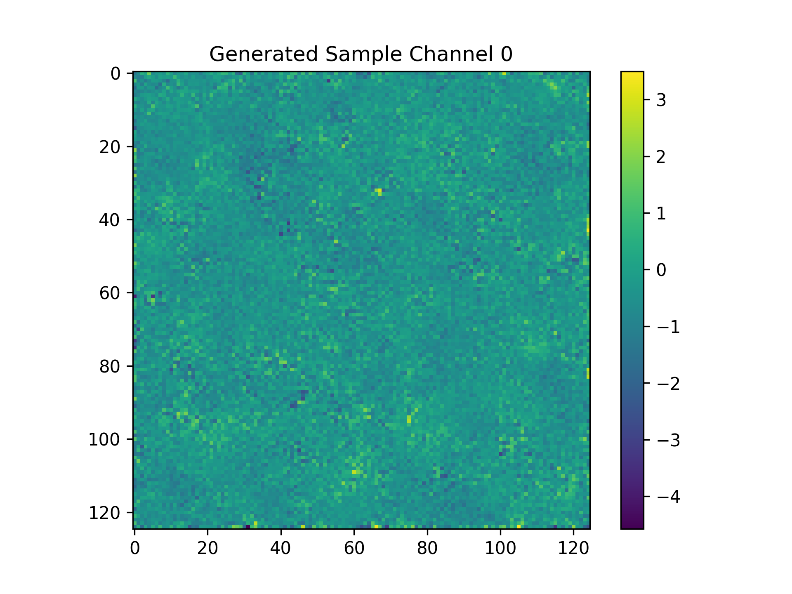
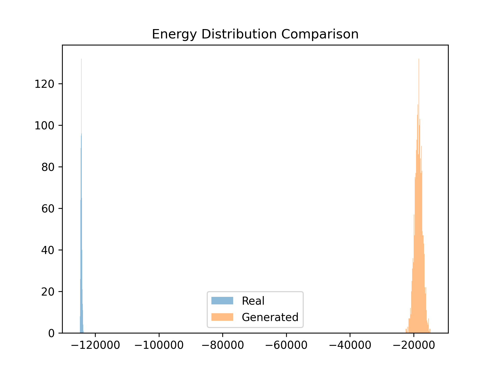

# Diffusion-Based Generative Modeling for Sparse Calorimeter Detector Data
## Example Generated Shower

## Energy Distribution Comparison

## Overview

This project implements a diffusion-based generative model trained on a sparse multi-channel detector dataset stored in HDF5 format.

The goal is to evaluate whether diffusion models can reproduce the statistical properties of calorimeter-like detector showers using only unlabelled data.

The implementation follows the core ideas of Denoising Diffusion Probabilistic Models (DDPM) and focuses on building a complete end-to-end pipeline including:

- dataset preprocessing
- forward diffusion (noise injection)
- timestep-conditioned denoising network
- reverse diffusion sampling
- physics-aware statistical evaluation

The objective of the project is proof-of-concept generation and evaluation rather than achieving state-of-the-art performance.

---

## Dataset

The dataset is stored in HDF5 format and contains detector events with the following structure:

60000 x 125 x 125 x 8

Where:

- 60000 → number of detector events
- 125 x 125 → spatial detector grid
- 8 channels → detector layers or feature maps

Each event represents a sparse energy deposition pattern in a detector.

Dataset sparsity:

- Approximately 98.9% of pixels are zero
- Approximately 1.1% of pixels contain energy deposits

This extreme sparsity makes the dataset challenging for generative models.

---

## Data Processing

The dataset is loaded using the `h5py` library and converted into PyTorch tensors.

Key preprocessing steps:

1. Subset sampling for faster experimentation
2. Conversion to PyTorch tensors
3. Channel-first format conversion for CNN compatibility
4. Normalization of values to the range [-1, 1]

Normalization used during training:

x = x / 255  
x = x * 2 - 1

Data loading implementation:

training/dataLoader.py

---

## Model Architecture

A lightweight convolutional neural network is used as the diffusion denoiser.

Architecture:

Input: (8, 125, 125)

Conv(8 → 32)  
ReLU  
Conv(32 → 64)  
ReLU  
Conv(64 → 32)  
ReLU  
Conv(32 → 8)

To condition the network on the diffusion timestep, a timestep embedding layer is used:

nn.Embedding(T, 32)

The timestep embedding is broadcast across spatial dimensions and injected into the feature maps after the first convolution layer.

This allows the model to learn a time-dependent denoising function:

predicted_noise = f(x_t, t)

Model implementation:

model/network.py

---

## Diffusion Process

The model follows the standard DDPM diffusion process.

Noise schedule:

beta_t ranges from 1e-4 to 0.02

Forward diffusion gradually adds Gaussian noise to the data:

x_t = sqrt(alpha_bar_t) * x_0 + sqrt(1 - alpha_bar_t) * epsilon

Where:

alpha_t = 1 - beta_t  
alpha_bar_t = cumulative product of alpha_t

The neural network is trained to predict the noise that was added:

Loss = MSE(predicted_noise, true_noise)

Diffusion implementation:

model/diffusion.py

---

## Training

Training configuration:

- diffusion steps: 200
- batch size: 32
- optimizer: Adam
- learning rate: 1e-4
- training subset: 5000 samples
- epochs: 30

Training procedure:

1. Sample random timestep t
2. Generate noisy input x_t
3. Predict noise epsilon
4. Compute mean squared error loss
5. Update model parameters

Training script:

training/train.py

---

## Sample Generation

New detector events are generated using reverse diffusion.

Generation starts from random Gaussian noise:

x_T ~ N(0, I)

Then iteratively denoises:

for t = T → 1  
    predict noise  
    compute x_(t-1)

Generation script:

generate.py

Example generated detector sample:

results/generated_sample.png

---

## Evaluation

Instead of relying only on visual inspection, the model is evaluated using physics-aware statistical comparisons.

### Total Event Energy Distribution

For each event we compute:

total_energy = sum(all detector cells)

This represents the total calorimeter energy deposited in the detector.

The distributions of real and generated events are compared using histograms.

Evaluation script:

evaluation/energy_distribution.py

Result:

results/energy_distribution.png

---

## Observations

The diffusion model successfully generates sparse detector-like patterns with localized energy deposits.

However, the generated energy distribution currently shows a scale mismatch compared to real events.

Possible causes include:

- extreme dataset sparsity (approximately 98.9% background pixels)
- normalization bias due to zero-dominated data
- limited number of training updates

Despite this limitation, the project demonstrates a fully functional diffusion-based generative pipeline for sparse detector data.

---

## Project Structure

diffusion-calorimeter-generation/

inspect/  
    inspect_data.py  
    visualize.py  

model/  
    diffusion.py  
    network.py  

training/  
    dataLoader.py  
    train.py  

evaluation/  
    energy_distribution.py  

results/  
    generated_sample.png  
    energy_distribution.png  

generate.py  
README.md

---

## Future Work

Potential improvements include:

- longer diffusion training
- improved normalization strategies
- spatial shower structure analysis
- additional evaluation metrics such as:
  - sparsity distribution
  - radial shower profiles
  - Wasserstein distance between distributions

These improvements would help better capture physical shower geometry in generated detector events.

---

## Conclusion

This project demonstrates a proof-of-concept diffusion-based generative model for sparse calorimeter detector data.

The implementation provides a full pipeline including:

- dataset preprocessing
- timestep-conditioned diffusion training
- reverse diffusion sample generation
- physics-aware statistical evaluation

The results highlight both the potential and the challenges of applying diffusion models to sparse detector simulation tasks.
