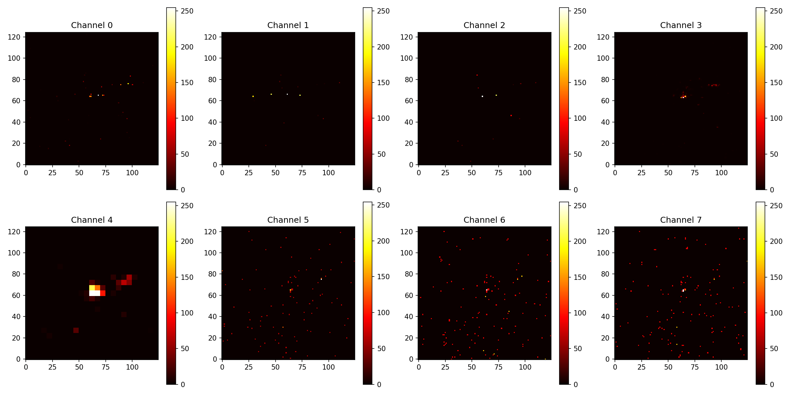
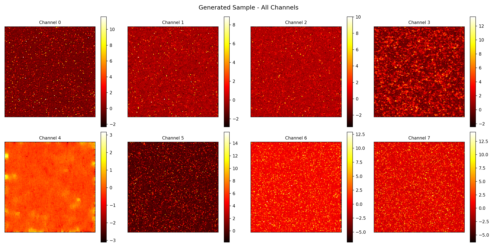

# Diffusion-Based Generative Modeling for Sparse Calorimeter Detector Data

## Overview

This project implements a diffusion-based generative model for highly sparse multi-channel calorimeter-like detector data.

The goal is to explore whether denoising diffusion probabilistic models (DDPMs) can learn and reproduce the statistical and spatial properties of sparse detector showers.

The implementation includes a complete end-to-end pipeline covering:

* dataset preprocessing
* forward diffusion (noise injection)
* timestep-conditioned denoising network
* reverse diffusion sampling
* physics-aware statistical evaluation

This project is designed as a **research-oriented prototype**, focusing on understanding model behavior on sparse data rather than achieving state-of-the-art performance.

---

## Project Status

This project is currently under active development as part of ongoing research and a GSoC proposal.

The core diffusion pipeline is implemented and functional. However, the model is still being refined and currently exhibits known challenges such as:

* instability in total energy prediction
* difficulty learning meaningful sparse structures
* imbalance across detector channels

Results and evaluation metrics are being continuously updated as improvements are explored.

---

## Dataset

The dataset consists of sparse calorimeter-like detector events stored in HDF5 format with the shape:

60000 × 125 × 125 × 8

Where:

* 60000 → number of events
* 125 × 125 → spatial grid
* 8 channels → detector layers

Each event represents energy deposition across detector layers.

### Sparsity

* ~98.9% of pixels are zero
* ~1.1% contain energy deposits

This extreme sparsity makes the problem significantly challenging for generative models.

---

## Data Processing

The dataset is loaded using `h5py` and converted to PyTorch tensors.

Key preprocessing steps:

* subset sampling for faster experimentation
* conversion to channel-first format
* normalization of input values
* optional logarithmic scaling to handle dynamic range

These steps help stabilize training under highly sparse conditions.

---

## Model Architecture

The current prototype uses a lightweight convolutional denoising network with timestep conditioning.

Key components:

* convolutional layers for feature extraction
* timestep embedding using `nn.Embedding`
* coordinate injection (spatial channels) to preserve positional structure
* energy-aware conditioning through global energy signals

The model learns to predict noise at each diffusion timestep:

predicted_noise = f(x_t, t)

This forms the basis for reverse diffusion sampling.

---

## Diffusion Process

The implementation follows the standard DDPM framework.

Noise schedule:

beta ranges from 1e-4 to 0.02 over 200 timesteps

Forward process:

x_t = sqrt(alpha_bar_t) * x_0 + sqrt(1 - alpha_bar_t) * epsilon

The model is trained to predict the added noise.

---

## Training

Training configuration (current prototype):

* diffusion steps: 200
* batch size: 32
* optimizer: Adam
* learning rate: 3e-5
* training subset: 5000 samples
* epochs: ongoing (intermediate results ~70–80 epochs)

The training objective includes noise prediction with additional weighting to emphasize high-energy regions.

---

## Sample Generation

New samples are generated using reverse diffusion, starting from Gaussian noise:

x_T ~ N(0, I)

The model iteratively denoises the sample to produce a structured detector event.

---

## Evaluation

The model is evaluated using physics-inspired statistical comparisons:

### Metrics

* total event energy distribution
* radial shower profile
* sparsity (fraction of zero-valued cells)
* visual comparison of real vs generated samples

These metrics help assess whether generated samples match real detector behavior.

---

## Sample Results

### Real vs Generated (Intermediate Training)

**Real Sample**



**Generated Sample**



---

## Observations

Initial results show that the model is able to generate sparse activation patterns, but fails to accurately reproduce the structured energy deposition observed in real data.

Key challenges observed:

* generated samples exhibit noisy and diffuse activations instead of localized energy clusters
* total energy distribution shows mismatch compared to real data (energy instability)
* extreme sparsity (>98%) leads to collapse toward near-zero predictions in early training

These observations highlight the difficulty of modeling highly sparse calorimeter data and motivate improvements in architecture, conditioning, and loss design.

---

## Project Structure

diffusion-calorimeter-generation/
```
├── inspect/
│ ├── inspect_data.py
│ └── visualize.py

├── model/
│ ├── diffusion.py
│ └── network.py

├── training/
│ ├── dataLoader.py
│ └── train.py

├── evaluation/
│ └── energy_distribution.py

├── results/
│ ├── generated_samples.png
│ └── energy_distribution.png

├── generate.py
└── README.md
└── compute_norm.py
└── .gitignore

```
---

## Future Work

Planned improvements include:

* improved architectural design (U-Net, 3D extensions)
* better handling of sparsity and energy imbalance
* incorporation of physics-informed loss functions
* improved evaluation using statistical distances (KL, Wasserstein)
* faster sampling methods for practical simulation

---

## Note on Proposal Context

This repository is actively being developed as part of a GSoC proposal for ML4SCI.

The results and implementation may differ slightly from those described in the proposal due to ongoing experimentation and continuous improvements.
